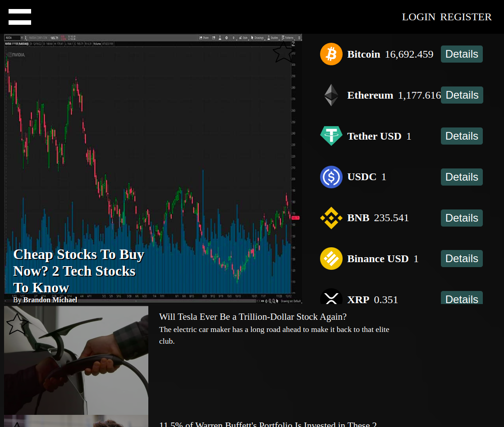

# Coins

This project was generated with [Angular CLI](https://github.com/angular/angular-cli) version 14.2.9.

## Development server

Run `ng s` for a dev server. Navigate to `http://localhost:4200/`. The application will automatically reload if you change any of the source files.

## API

Use Coinranking for crypto currencies and Alpha Vantage for the news;
https://www.alphavantage.co/
https://coinranking.com/

### Keys
Change {stockNewsKey} with your api key from alphavantage and {cryptoKey} with your api key from conranking.

# About
Using Coinranking and Alphavantage API with Angular and firebase for storage.
Basic GET/POST/PUT/DELETE methods.

### Register and login to acces profile page and to get access to the recent news

### Click on the details on the coin you want to add in yout profile or the star in the news.

### Look at your collection of coins and news at the profile page

